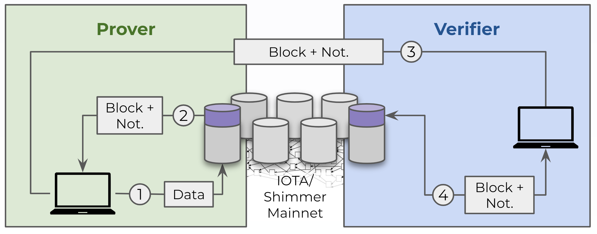

# Pattern: Tokenless Data Notarization
- Notarization in this context is just a synonyme for proof of inclusion
- It describes the process of embedding a block in the immutable data structure of the Tangle, which allows to proof block content wasn’t altered at a later point in time

## Pattern Description
- A **Prover** wants to prove to a **Verifier**, that a dataset/file was not altered since a specific time in the past by notarizing the hash of it
- The party writing to the Tangle (**Prover**) is the same party reading from it, which allows reading a block by its block Id

### Architecture


### What you will need
- NodeJS
- Hornet Node with INX PoI Plugin
- iota.js
- tbd

### Steps
1. **Prover:** ```node create-notarization.js```
    - Attach dataset to the Tangle in a data block
    - Wait for milestone confirmation of the block
    - Fetch block together with notarization and store in Folder 'Exchange'
    - Provide notarized block to **Verifier**
2. **Verifier:** ```node verify-notarization.js```
    - Receive notarized block from **Prover**
    - Checks validity of notarized block